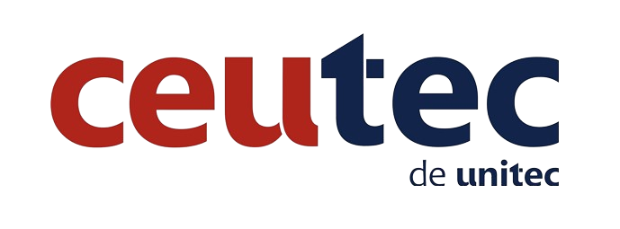
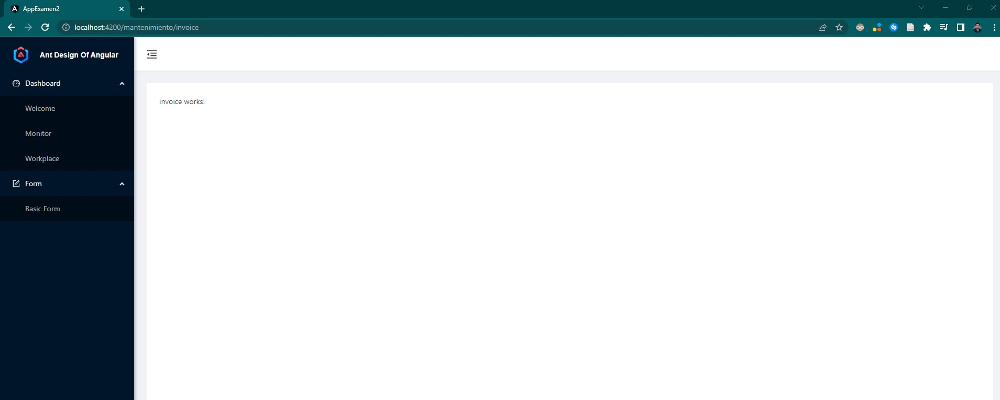
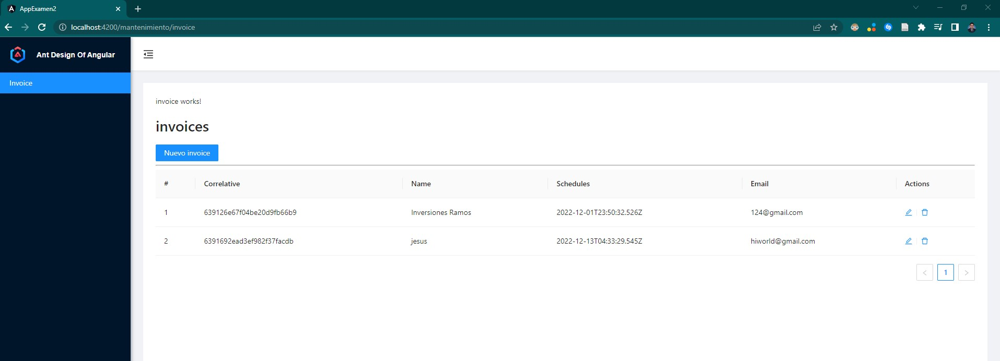
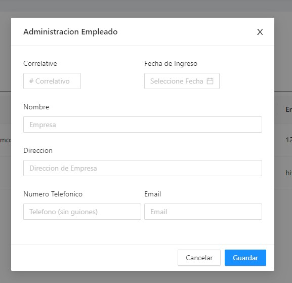
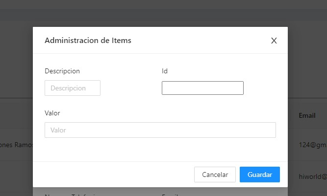

## Examen 2 Programacion IV

## Introduccion
En el siguiente repositorio se publica el ejercicio aplicado durante el Examen 2 de la clase de programacionIV

## Imagenes
Creacion de plataforma usando angular

Eliminacion de Paginas en Sidemenu, dejando unicamente INVOICE

Creacion de tabla en la pagina de invoice

Creacion de formulario de NEW INVOICE

Creacion de formulario de ADD ITEM

## Enlaces
### Enlace de Github pages:
[Examen2](https://srgio29.github.io/Examen2/#/mantenimiento/invoice)